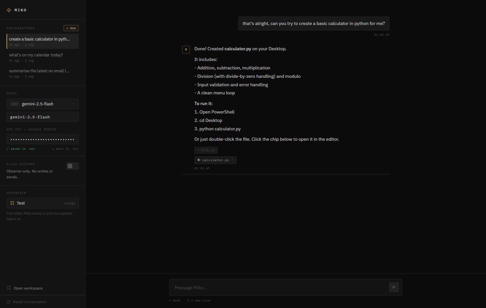
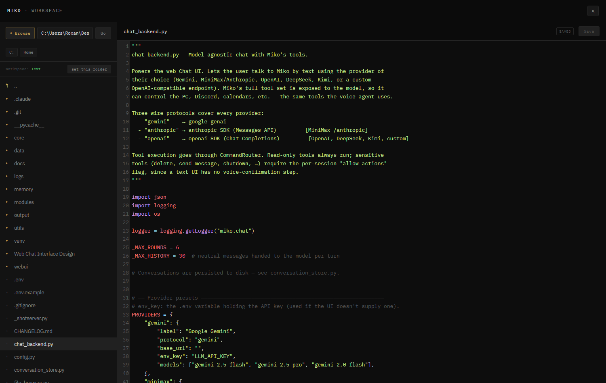

# Miko — a personal AI agent for Windows

Miko is a personal AI agent for Windows that **researches, remembers, watches, and ships
code** — reachable by **voice or a web chat UI**. It runs multi-round web research and
saves cited reports, keeps a local second-brain memory, controls your PC / Discord /
email / calendars, **keeps standing watch** (inbox watches, scheduled tasks, calendar
briefs — set up just by asking in conversation), and — the headline — **directs Claude
Code as a pair-programming teammate** to actually change your repos, with your approval
and per-round git revert.

It's a **self-hosted, single-user** tool (your keys live in a local `.env`). You bring API
keys for the models you use; several integrations below are **optional and require their
own setup** — those are marked. Miko is **bilingual** (`MIKO_LANGUAGE=en` or `ro`, default
English) and replies in the language you write/speak.

> A personal take on JARVIS: loyal, direct, fast — and now a coding teammate, not just a chatbot.

**What it does**

- **Pair programming** — Miko directs **Claude Code** (the CLI) as a coder: Miko
  instructs, Claude implements in a real repo and reports back, they iterate until both
  agree it's done. **Autonomous** or **Controlled** (approve each round) mode; every round
  is **git-checkpointed** with a per-round **Revert**. *Requires Claude Code installed and
  your own Claude plan/API — and is subject to Claude's own rate limits.*
- **Deep research** — distills a clean subject from your request, runs **iterative
  rounds** (search → read → find gaps → search again) in parallel, writes a **cited**
  report and saves it to the vault. Report quality depends on which sources are fetchable
  (many sites block scrapers; those are skipped). Live progress in the Chat UI; spoken
  summary by voice. Pick the research model (defaults to Gemini Flash).
- **Second-brain memory** — a local-embedding (fastembed) semantic memory in SQLite that
  learns facts from your conversations (reconciles corrections instead of duplicating),
  recalls by meaning, keeps an episodic log, and stores notes as an **Obsidian-compatible
  vault** (PARA folders + `[[wikilinks]]`). Works in voice and chat. You can also
  **import the memory you already have in another AI** — point Miko at a Google Takeout
  export (Gemini), a ChatGPT data export, or just pasted text, review what it found, and
  it folds those facts into its own memory. *Falls back to a provider embedding API, then
  keyword search, if fastembed isn't installed.*
- **Sub-agents** — Miko can spawn up to 5 focused, **read-only** agents in parallel to
  research several angles or inspect multiple files at once, then synthesize their findings.
- **Web Chat UI** (`/chat`) — any model (Gemini, OpenAI, Anthropic Claude, MiniMax,
  DeepSeek, Kimi, xAI Grok, or any OpenAI-compatible endpoint), a **live activity view**
  that narrates what Miko is doing in plain language (*Creating app.py*, *Modifying
  styles.css*, *Researching…*) with each tool call as it runs, a **Stop** button, an
  **approval mode** (review file/command changes as diffs before they apply),
  **git-backed per-message undo** for conversations and workspace changes, **file &
  image attachments** (drag, drop, or paste — handled sensibly even on models without
  vision), per-model persona/skill/effort settings, a built-in file explorer + editor, an
  **Inbox viewer**, a **task scheduler with an interactive calendar**, a **Memories** panel
  to import memory from another AI, a side panel of your **sub-agent runs**, an in-UI
  **Settings panel** for every key and credential, and a selectable workspace. Conversations
  are resumable, queued messages are sent in order, and a running turn **keeps going (and
  its live status keeps updating) if you switch conversations** — it never silently cancels.
- **Email watching** *(optional)* — read, search, triage, and send mail; browse the same
  inbox Miko reads **inside the UI** (rich HTML, inline images, attachments); and set
  **standing inbox watches** — tell Miko *"let me know when Andra emails me"*
  mid-conversation and she schedules it herself, then pings you on Discord with a snippet
  within ~30 seconds of the mail landing.
- **Scheduler** — recurring or one-off tasks in plain language ("every morning at 8, DM
  me my calendar") or from an **interactive calendar** in the Tasks panel; results arrive
  as Discord DMs. Miko sets these up herself when you ask in conversation — no forms.
- **Voice** — two engines: the recommended **chat voice** path
  (`MIKO_VOICE_ENGINE=chat`) runs mic → STT → the normal Miko chat/tool brain → TTS on
  OpenRouter, Gemini, MiniMax, OpenAI, LM Studio, Ollama, or any OpenAI-compatible
  endpoint. The older **Gemini Live** path (`MIKO_VOICE_ENGINE=live`) is still available
  for realtime native audio. ACTIVE / STANDBY / MUTE modes work across both. *Needs a
  Gemini key for STT fallback, even when the voice brain is another provider.*
- **PC control** — open apps, file operations, system info, screenshots, reminders,
  clipboard, volume & media keys. *Windows-specific.*
- **Project mapping** — point Miko at a project folder; it scans it, writes a profile to
  the vault, and keeps it in context so it knows what you're building.
- **Calendars** *(optional)* — iCloud (CalDAV) + Microsoft/Outlook (Graph), with
  morning/midday/night Discord briefs.
- **Discord** — control Miko from your phone via DMs (text or voice notes), stream music
  into a voice channel, and control your **personal** Discord account by voice.
- **Optional integrations** *(each needs setup/deps)* — **browser automation**
  (Playwright), an **MCP client** (use tools from external Model Context Protocol
  servers), and a **MiniMax backend** + HTTP **tool server** so external agents can call
  Miko's tools.

---

## Contents

1. [Prerequisites](#prerequisites)
2. [Installation](#installation)
3. [Discord bot setup](#discord-bot-setup)
4. [Calendar setup (optional)](#calendar-setup-optional)
5. [Personal Discord voice control (optional)](#personal-discord-voice-control-optional)
6. [MiniMax & external agents (optional)](#minimax--external-agents-optional)
7. [Chat UI](#chat-ui)
8. [Second brain & intelligence](#second-brain--intelligence)
9. [First run](#first-run)
10. [Voice model setup](#voice-model-setup)
11. [Voice commands](#voice-commands)
12. [Architecture](#architecture)
13. [Troubleshooting](#troubleshooting)

---

## Prerequisites

| Requirement | Minimum version | Note |
|-------------|-----------------|------|
| Python | 3.11+ | [python.org](https://python.org) |
| FFmpeg | any stable build | Must be on your `PATH` |
| Google Gemini API key | — | [aistudio.google.com](https://aistudio.google.com/apikey) |
| Windows 11 | — | Windows-only (uses `pycaw`, `winsound`) |
| Microphone + speakers | — | Required for voice I/O |

### Installing FFmpeg

1. Download from [ffmpeg.org/download.html](https://ffmpeg.org/download.html) (Windows builds).
2. Extract the archive (e.g. `C:\ffmpeg\`).
3. Add `C:\ffmpeg\bin` to your system `PATH`.
4. Verify with `ffmpeg -version` in a terminal.

---

## Installation

```bash
# 1. Clone or download the project
cd "C:\Users\YourName\Desktop\Jarvis V2"

# 2. Create a virtual environment (recommended)
python -m venv venv
venv\Scripts\activate

# 3. Install dependencies
pip install -r requirements.txt

# 4. Configure environment variables
copy .env.example .env
notepad .env
```

Edit `.env` and fill in at least `LLM_API_KEY`. See `.env.example` for every
supported setting.

**Language:** set `MIKO_LANGUAGE=en` for English (default) or `MIKO_LANGUAGE=ro`
for Romanian. This controls the system prompt, spoken confirmations, and mode
announcements. Regardless of the setting, Miko will reply in whichever of the two
languages you actually speak.

---

## Voice model setup

Miko has two voice engines:

- `MIKO_VOICE_ENGINE=chat` — recommended. Uses the same provider-agnostic brain as the
  Chat UI: microphone audio is segmented with VAD, transcribed, sent to `chat_backend.chat()`,
  then spoken with edge-tts. This path gets the normal Miko tools, memory, scheduler,
  Discord, and safety fixes.
- `MIKO_VOICE_ENGINE=live` — legacy/realtime Gemini Live audio. Lower latency, but tied to
  the Live preview API and its realtime session behavior.

For long spoken prompts, chat voice records up to `MIKO_VOICE_MAX_UTTER_SECS` seconds per
STT clip (default `90`) and waits `MIKO_VOICE_TURN_GRACE_SECS` seconds (default `0.8`) to
merge follow-on chunks before Miko answers. Raise the grace value if Miko still responds
before you finish a multi-part prompt with longer pauses.

### API voice brain

For the most responsive daily voice mode, use an API provider:

```env
MIKO_VOICE_ENGINE=chat
MIKO_VOICE_PROVIDER=openrouter
MIKO_VOICE_MODEL=openrouter/free
MIKO_VOICE_BASE_URL=
MIKO_VOICE_API_KEY=
```

`MIKO_VOICE_PROVIDER` must be one of the providers in `chat_backend.py` (`gemini`,
`openrouter`, `nvidia`, `openai`, `anthropic`, `minimax`, `deepseek`, `kimi`, `grok`, or
`custom`).
`MIKO_VOICE_MODEL` is passed directly to that provider. For OpenRouter, individual `:free`
model slugs can disappear or become paid; `openrouter/free` is the safer free-router
choice. Set `OPENROUTER_API_KEY` in `.env` or via the Settings panel. OpenRouter free
models still have account/day quota; if that quota returns `429`, voice automatically
retries the same turn through `MIKO_VOICE_FALLBACK_PROVIDER` (default `gemini`). Set it
to `off` to disable fallback.

For NVIDIA NIM / build.nvidia.com:

```env
MIKO_VOICE_ENGINE=chat
MIKO_VOICE_PROVIDER=nvidia
MIKO_VOICE_MODEL=z-ai/glm-5.2
NVIDIA_API_KEY=<your-nvidia-key>
```

The NVIDIA provider uses `https://integrate.api.nvidia.com/v1`, so you do not need to set
`MIKO_VOICE_BASE_URL` unless you are overriding it for testing.

To try DiffusionGemma after GLM, keep the same provider/key and switch only the model:

```env
MIKO_VOICE_MODEL=google/diffusiongemma-26b-a4b-it
```

Miko sends NVIDIA's `chat_template_kwargs.enable_thinking=true` automatically for that
model.

If a provider/model rejects tool/function calls, Miko retries that turn without tools.
That keeps the conversation alive, but the selected model becomes **talk-only** for that
turn and must not be expected to run actions.

### Local voice brain with LM Studio / Ollama / llama.cpp

For a local OpenAI-compatible server, use `custom` plus the local base URL:

```env
MIKO_VOICE_ENGINE=chat
MIKO_VOICE_PROVIDER=custom
MIKO_VOICE_MODEL=<exact model id shown by LM Studio>
MIKO_VOICE_BASE_URL=http://127.0.0.1:1234/v1
MIKO_VOICE_API_KEY=lm-studio
```

LM Studio's default local server is usually `http://127.0.0.1:1234/v1`. The API key can be
any non-empty string unless your local server enforces one.

Miko's full tool schema is large. With all tools enabled, the initial prompt can exceed an
8k local context before the user's utterance is added. Load local models with enough context:

- Full tools: `16384` minimum; `32768` is more comfortable if the GPU can handle the KV cache.
- Compact tools: works better for 8k-16k contexts and local 7B-14B models.

Compact voice tools are controlled by:

```env
MIKO_VOICE_COMPACT_TOOLS=true
```

Compact mode keeps everyday spoken tools (volume/media, app/window control, reminders,
calendar basics, Discord basics, notes/memory, weather/web search) and omits heavyweight
schemas (browser automation, deep research, sub-agents, Claude Code, email, file indexing,
journey planning, and project/memory import tools). Set it to `false` if your local model
is loaded with a large enough context and you want the full tool list.

Voice interruption is controlled by:

```env
MIKO_VOICE_INTERRUPT=true
MIKO_VOICE_INTERRUPT_MODE=speech
MIKO_VOICE_INTERRUPT_SENSITIVITY=medium
```

With `MIKO_VOICE_INTERRUPT_MODE=speech`, sustained user speech while Miko is talking cuts off
current TTS playback, then the captured utterance continues into the normal chat brain.
That means "No, I solved that" can stop a long answer and become the next turn.

`MIKO_VOICE_INTERRUPT_SENSITIVITY` controls how eager barge-in is:

- `high` — fastest interruption, best for quiet rooms.
- `medium` — default; requires a stronger sustained signal before stopping TTS.
- `low` — stricter; use this when fans, speakers, or room noise false-trigger interruption.

For fine tuning, set `MIKO_VOICE_INTERRUPT_MIN_MS` and
`MIKO_VOICE_INTERRUPT_THRESHOLD_MULTIPLIER` directly.

Set `MIKO_VOICE_INTERRUPT_MODE=phrase` if your speakers cause false interrupts. Phrase mode
only stops for commands such as "Miko stop", "stop talking", "Miko taci", or "Miko gata";
other audio captured during TTS is discarded.

Observed local tradeoff: an RX 6750 XT 12 GB can load a 9B Qwen-style model at 32k context,
but full-tool voice may feel too slow. On that class of GPU, API voice is usually the
better daily driver; local mode remains useful for testing or for machines with more VRAM.

---

## Discord bot setup

Only needed if you want the Discord features (music in a voice channel, DMs,
notifications):

1. Go to [discord.com/developers/applications](https://discord.com/developers/applications).
2. Click **New Application** and give it a name (e.g. "Miko").
3. Open **Bot → Add Bot** and confirm.
4. Under **Token**, click **Reset Token** and copy it into `.env` as `DISCORD_TOKEN`.
5. Under **Privileged Gateway Intents**, enable:
   - Server Members Intent
   - Message Content Intent
   - Presence Intent
6. Under **OAuth2 → URL Generator**:
   - Scopes: `bot`
   - Bot permissions: `Send Messages`, `Read Message History`, `Connect`, `Speak`, `Use Voice Activity`
7. Open the generated URL in a browser and add the bot to your server.
8. Copy your server ID into `.env` as `DISCORD_GUILD_ID`.
   (Enable Developer Mode in Discord → right-click the server → Copy Server ID.)

**Tell Miko who *you* are.** Set `DISCORD_OWNER` to your exact Discord username (and,
optionally, `OWNER_ALIASES` to comma-separated nicknames). When you say *"DM me"* or
*"invite me to voice"*, Miko resolves "me" to **that** account — never to a
similarly-named friend. Both are editable from the UI's Settings panel.

---

## Calendar setup (optional)

Miko can read and create events in your calendars, and send you **Discord DM
reminders** 30 minutes and 5 minutes before each event.

### iCloud (CalDAV)

1. Sign in at [appleid.apple.com](https://appleid.apple.com) → **Sign-In and Security
   → App-Specific Passwords** → generate one.
2. In `.env`:
   ```
   ICLOUD_EMAIL=your_apple_id@example.com
   ICLOUD_APP_PASSWORD=xxxx-xxxx-xxxx-xxxx
   ```

> Events must live in an **iCloud** calendar (not "On My iPhone", which is local-only)
> to be visible over CalDAV.

### Microsoft Teams / Outlook (Graph API)

1. Go to [portal.azure.com](https://portal.azure.com) → **Entra → App registrations →
   New registration**.
   - Account types: *Accounts in any organizational directory and personal Microsoft
     accounts* (register under a **personal** account to avoid work-tenant admin gates).
2. Copy the **Application (client) ID**.
3. **API permissions** → Microsoft Graph → Delegated → `Calendars.ReadWrite`.
4. **Authentication** → Allow public client flows → **Yes**.
5. In `.env`:
   ```
   AZURE_CLIENT_ID=<application-client-id>
   AZURE_TENANT_ID=common
   ```
6. The first calendar command prints a device-code login link — open it once, sign in,
   and the token is cached + auto-refreshed afterwards.

> If your school/work tenant blocks third-party apps, register the app under a personal
> Microsoft account with `AZURE_TENANT_ID=common`.

---

## Personal Discord voice control (optional)

Lets Miko control **your own** Discord account (not the bot) over Discord's local RPC
socket — join a voice channel as you, move between channels, mute/deafen yourself.
Useful for "Miko, connect me to the *General* voice channel and mute me."

**Requirements:** the Discord **desktop** client running and logged into your account.
Because you own the app, the restricted `rpc` scopes work without Discord's whitelist.

1. In the [Developer Portal](https://discord.com/developers/applications) app (you can
   reuse your bot's app) → **OAuth2** → copy the **Client ID** and **Client Secret**,
   and add a redirect URI of `http://localhost`.
2. In `.env`:
   ```
   DISCORD_RPC_CLIENT_ID=<client-id>
   DISCORD_RPC_CLIENT_SECRET=<client-secret>
   DISCORD_RPC_REDIRECT=http://localhost
   ```
3. Say **"Miko, connect to my Discord account"** once → approve the popup in your Discord
   client. The token is cached afterwards and it runs headless.

---

## MiniMax & external agents (optional)

### MiniMax backend for phone commands

By default, Discord DM commands are processed with Gemini. Set a MiniMax key to use it
instead (Anthropic-compatible or OpenAI-compatible endpoints are auto-detected):

```
MINIMAX_API_KEY=<your-key>
MINIMAX_BASE_URL=https://api.minimax.io/anthropic
MINIMAX_MODEL=MiniMax-M3
```

### Tool server for external agents

Miko exposes all of its tools over HTTP so other agents (e.g. **Hermes** on WSL2) can
call them — and this is also how you run Miko **chat-only**, without the voice loop (it
still serves the Chat UI at `/chat`):

```bash
python start_tools_server.py
```

This starts the HTTP tool server (default port `7832`), the Discord bot, and the file
indexer — but no microphone or Gemini Live session, so the agent can use Miko's tools
without Miko listening. Tool schemas are served at `GET /tools?format=openai|anthropic|gemini`.

**The server binds to `127.0.0.1` (loopback) by default** — it exposes shell execution,
file read/write, and your API keys, so it is not reachable from the network unless you
opt in. To let another machine (or Hermes on WSL2, which reaches Windows via the vEthernet
gateway IP, not loopback) call it, set **both**:

```
TOOL_SERVER_HOST=0.0.0.0        # or a specific interface
TOOL_SERVER_KEY=<random-secret> # required — callers send Authorization: Bearer <key>
```

If `TOOL_SERVER_HOST` is set to a network address without `TOOL_SERVER_KEY`, Miko refuses
and falls back to loopback. Trusted agents may send `X-Bypass-Confirmation: true` to skip
the voice-confirmation gate on destructive tools — the safety layer (blocked paths,
permanently blocked tools) still applies even then.

## Chat UI

The tool server also hosts a **web chat app** where you can type to Miko, pick your
model, browse and edit files, and choose the folder she works in. Open it at:

```
http://localhost:7832/chat
```

(Available whenever `python main.py` or `python start_tools_server.py` is running.)

|  |  |
|:---:|:---:|
|  |  |
| Persistent conversations, model/key/workspace panels, and replies with tool + file-link chips | The built-in **Workspace** — browse any folder and edit files with syntax highlighting |

**Chat & models**

- **Pick a provider per chat:** Google Gemini, MiniMax (Anthropic-compatible), OpenAI,
  OpenRouter, NVIDIA NIM, DeepSeek, Kimi (Moonshot), or a **custom**
  OpenAI-compatible endpoint (LM Studio, Ollama, etc.) — enter any base URL + model.
- **API keys** can be typed into the UI (kept in your browser) **or saved to `.env`** —
  enter a key and click **“save to .env”** to persist it server-side, no file editing.
- **Miko's full tool set** is available to the model — it can control the PC, Discord,
  calendars, notes, files, and more, mid-conversation. Each tool she uses shows as a chip.
- **Safety:** read-only tools always run; sensitive actions (delete, send message,
  shutdown, …) only run when you flip **“Allow actions”** on, since a text chat has no
  spoken confirmation step.

**Workspace — file explorer + editor**

- Open the **Workspace** (sidebar button, or click any file chip) for a built-in,
  VS Code-style **file explorer + code editor**. Browse folders, open files, edit with
  syntax highlighting, and save with the button or **Ctrl/⌘-S**.
- **Go anywhere:** a **Browse…** button opens the native Windows folder dialog, plus an
  editable address bar and drive-letter shortcuts. Browsing and reading are unrestricted;
  only *writes* into the Windows system folders are blocked.
- **Clickable file links:** when Miko creates or edits a file, it appears as a chip under
  her message — click it to open the file straight in the editor.

**Selectable workspace**

- Choose the folder Miko **works in right now** from the sidebar (or **“set this folder”**
  while browsing). The chosen workspace is where the explorer opens, is told to Miko (so
  *“what workspace are you in?”* and *“create a file here”* follow your choice), and is the
  working directory her `run_command` executes in. It persists across restarts.

**Undo, recovery & queued messages**

- Every normal chat turn is **git-checkpointed** in the selected workspace. If the folder
  is not already a git repo, Miko initializes one locally so undo can still restore diffs.
- Hover any saved message to reveal an undo button. On a **user message**, undo rewinds to
  *before that prompt was sent*; on an assistant message, it rewinds to that reply. The
  conversation is trimmed and the workspace is restored to the stored git snapshot.
- Created/modified files are reverted through git, and generated file paths recorded in
  the dropped messages are removed too, including ignored/untracked generated files.
- If Miko is already working, new normal chat messages are queued FIFO and sent
  automatically after the active turn finishes. Failed or interrupted turns show a retry
  affordance; orphaned prompts after a crash show a **Continue** prompt when reopened.
- Sub-agent batches persist in the side panel across refresh/restart. Failed, cancelled,
  or interrupted agents can be retried as a fresh batch using the current provider/key.

**Attachments — send files & images**

- Attach with the paperclip, **paste**, or **drag-and-drop** (up to 12 MB per file).
- **Images:** vision-capable models (Gemini, Claude, GPT-4o…) see them directly; for
  text-only models Miko **auto-captions** the image server-side so nothing is silently
  dropped — every model can talk about what you sent.
- **Documents:** Word / PowerPoint / Excel / OpenDocument / PDF / RTF are **text-extracted
  on the server** — no converters, no shell tricks — plus any plain-text/code file as-is.

**Inbox — see what Miko sees**

- The **Inbox** button opens the mailbox Miko watches: unread filter, **rich HTML
  rendering** (sandboxed — no scripts run), **inline images**, and attachment
  previews/downloads. Reading never marks mail as seen.

**Tasks — the scheduler panel**

- Lists every scheduled task and inbox watch, live (pause / resume / delete — no restart).
- Add tasks in **plain language** (*“every 30 minutes, check HN for AI news and DM me”*)
  or from the **interactive calendar**: click a day, type the task, done.

**Memories — import what another AI knows about you**

- The **Memories** button (next to **Open workspace**) imports memory exported from another
  assistant. Drop in a **Google Takeout** export of Gemini (`.zip` or the extracted folder),
  a **ChatGPT** data export, or paste text — by upload, drag-and-drop, or a path on your PC
  (best for big exports, since the server reads them straight from disk). Miko previews the
  facts + memories it found — **scanning a long history in several passes** so nothing buried
  is missed — and you tick what to keep before anything is saved.

**Settings — keys & credentials in the UI**

- A grouped **Settings panel** (footer) edits every `.env` credential — Discord, email,
  calendars, model providers — without touching a file. Secrets are **write-only**: the
  server masks saved values and never sends them back to the browser. The Reset
  conversation button next to it asks twice, so a stray click costs nothing.

> **Heads-up:** the Chat UI is served by the same process as the tools. Changes to the page
> appear on a browser refresh, but new server features (file browser, workspace, …) need the
> server **restarted** (`python start_tools_server.py` or `python main.py`).

---

## Second brain & intelligence

Miko is more than a command runner — it learns from you and from its own research, and
keeps that knowledge in a vault you own. Everything below runs **locally** (embeddings via
`fastembed`; a SQLite vector store) and works in **both** voice and chat. The "smart" work
runs asynchronously on a cheap model, so per-turn cost stays small.

### Memory that actually learns

- **Self-correcting facts.** A single memory-aware *extract → reconcile* pass (Mem0-style)
  reads your current memory and the latest turn and emits canonical add/update/delete
  operations — so "actually, my name is Dan" **overwrites** the right fact instead of piling
  up duplicates. Tools: `remember`, `recall`, `forget`.
- **Recall by meaning.** Retrieval is a hybrid score — semantic similarity + keyword + recency
  + importance — and only the top few, relevant memories are injected per turn (a tight token
  budget), not a fixed blob.
- **Episodic memory + reflection.** Miko keeps a short episodic log of what you've been doing
  and periodically distills it into durable *insights* ("you've been building Miko's memory all
  week"), pruning the raw log — memory that gets **smaller and smarter** as it grows.

### The vault is an Obsidian second brain

Your notes folder (`Desktop/Miko Notes`, or `MIKO_NOTES_DIR`) is a plain-Markdown vault you can
open directly in **[Obsidian](https://obsidian.md)** — graph view, backlinks, search, zero
migration. Miko lays a light **PARA** structure over it (`Inbox / Projects / Areas / Resources
/ Archives / Daily`), routes captures and research into the right folders, and links related
notes with `[[wikilinks]]`. Deleting a note also clears it from recall.

### Import your memory from another AI

Already have history with another assistant? Bring it across. Open the **Memories** panel
(or use the `import_memories` tool by voice/chat) and give Miko a **Google Takeout** export
of Gemini (a `.zip` or the extracted folder), a **ChatGPT** data export, or just pasted text
— by upload, drag-and-drop, or a path to the file/folder on your PC. Miko extracts the
readable content (it walks Takeout's HTML/JSON), then **samples across the whole history in
several passes** (durable facts are scattered through a long chat log, not just at the top)
and proposes a list of facts + memories. You **review and tick what to keep**; nothing is
written until you confirm. Kept facts merge into long-term memory using the same
reconcile rules as live learning, and a provenance note is saved to the vault. Every memory
note links to a single **`[[Memory]]` hub** so they form one connected cluster in Obsidian's
graph instead of floating orphans.

### Deep Research → permanent knowledge

Toggle the **Deep Research** skill (or say "research …"): Miko **distills a clean subject** from
your request, then runs **iterative rounds** (1/2/3 by effort) of plan → **parallel** search →
**parallel** read → gap-analysis → follow-up questions, stopping when coverage is complete. Sources
are ranked and de-duplicated by domain. It writes a **cited** report and **saves it as a linked
note in `Resources/`** — so next time you ask, plain recall already knows it. The Chat UI streams
live progress and you can **Stop** mid-run; by voice you get a spoken summary.

### Pair programming — Miko ↔ Claude Code

Miko can direct **Claude Code** (the CLI) as a coding teammate: **Miko = boss/instructor,
Claude Code = coder.** Toggle **Pair** in the composer, point it at a project folder,
pick **Autonomous** (run to completion) or **Controlled** (approve each round), and type a
goal. Miko instructs → Claude implements in the repo and reports → Miko reviews and pushes
back → they iterate until a **two-way handshake** (both agree it's done). It drives the
installed `claude` CLI headlessly with a resumed session, and **git-checkpoints every
round** so any change is **revertible from the UI** (per-round Revert button, like `/undo`).
Needs Claude Code installed (`npm i -g @anthropic-ai/claude-code`). A `code_with_claude`
tool exposes the same loop to voice / mid-chat.

### Live activity, Stop & sub-agents

Normal chat **streams what Miko is doing** — a "Working" card narrates the current step in
plain language (*Creating app.py*, *Modifying styles.css*, *Researching…*, *Coding with
Claude*) and shows each tool call as it runs (`→ web_search(…) ✓`) and which reasoning round
it's on, so the menu isn't a black box. The Send button becomes a **Stop** button while a turn
(or research) is running, and stopping is now **explicit** — switching conversations or a brief
network blip won't cancel a running turn; it finishes and persists. And Miko can **summon
sub-agents** (`spawn_agents`): up to five focused, read-only agents that run **in parallel** —
each searches/reads/recalls on its own and reports back — so big jobs (research several angles,
inspect many files) finish faster. Sub-agents can't make changes or spawn their own sub-agents.
A dockable **side panel** lists your sub-agent runs and their steps so they don't scroll away or
vanish on refresh. Miko-launched sub-agents default to the **main chat/voice model** that
summoned them; in Settings -> Sub-agents, set `MIKO_SUBAGENT_MODEL_MODE=custom` plus
`MIKO_SUBAGENT_PROVIDER` / `MIKO_SUBAGENT_MODEL` if you want delegated work to run on a
different model.

### Agents, skills & per-model settings

An **Agent / Skills** picker by the composer lets you choose an ECC **persona** (Chief of Staff,
Planner, Code Explorer/Reviewer, Security Reviewer) and toggle **skills** (Deep Research, Article
Writing, Brand Voice, Git/GitHub, Email/Knowledge Ops, Codebase Onboarding). These layer
trimmed, Miko-adapted instructions into the prompt and work on **every provider**. The selection —
plus an **effort** dial (Quick / Standard / Deep, which scales research depth) — is remembered
**per provider+model**. (Adapted from [ECC](https://github.com/affaan-m/ecc), MIT.)

### Project mapping (user-controlled)

Point Miko at a project folder (`add_project`) and it scans the structure + key files, writes a
concise profile into `Projects/`, and remembers it — so Miko always knows what you're building.
`list_projects` / `forget_project` manage them. Miko only maps folders **you** add.

### Calendar awareness

A daemon refreshes today's events and sends **morning / midday / night** briefs by Discord DM,
and the day's schedule is injected into Miko's context (voice + chat) so it always knows what's
on — without a calendar call every turn.

### Reinforced voice mode

Spoken replies are kept to one or two sentences (no filler). Beyond STANDBY (wake word + a short
follow-up window), there's a stricter **MUTE** mode ("mute yourself" / "complete silence" /
"leave me alone") — wake-word only, no window — exited with "Miko, wake up".

The recommended `MIKO_VOICE_ENGINE=chat` path routes voice through the same brain as the
Chat UI (mic → VAD → STT → `chat()` → neural TTS) on **any provider** — full memory,
watches, approvals, and tool fixes included — at the cost of a few seconds per turn. It
also supports local OpenAI-compatible servers such as LM Studio via
`MIKO_VOICE_BASE_URL` / `MIKO_VOICE_API_KEY`.

The older **Gemini Live** engine is still available for native realtime audio. It is
hardened where realtime voice actually breaks: when the connection drops, the session
**resumes with its context intact** (resumption handles) instead of starting over; long
sessions use **sliding-window context compression** instead of hitting a wall; a missing
or unplugged microphone gets a warn + retry every 30 s instead of a reconnect death-loop;
and reconnects back off exponentially.

A tool-discipline prompt layer keeps voice honest — every claimed action must be a real
tool call, so "I've sent it" means it was sent. For local/small-context models,
`MIKO_VOICE_COMPACT_TOOLS=true` trims the voice tool schema to everyday spoken controls;
set it to `false` for the full tool list when your model has enough context.
`MIKO_VOICE_INTERRUPT=true` plus `MIKO_VOICE_INTERRUPT_MODE=speech` lets you cut off a long
spoken answer naturally; lower `MIKO_VOICE_INTERRUPT_SENSITIVITY` or use `phrase` mode for
noisy rooms.

### Email, browser, scheduled tasks & MCP

Four optional capability systems Miko can use when configured:

- **Email** — read, search, and send mail over IMAP/SMTP (`list_emails`, `read_email`,
  `search_emails`, `send_email`), ask plain-language questions about recent mail
  (`triage_inbox` — "any job-related emails in the past 2 days?"), and browse the inbox
  in the UI (the **Inbox** button). **Inbox watches** are standing by default: say
  *"look out for emails from andra@…"* in conversation and Miko registers the watch
  herself (`watch_email`), then DMs you on Discord — sender, subject, and a **snippet of
  the body** — within ~30 seconds (`MIKO_EMAIL_WATCH_INTERVAL`, default 30s). Watches
  catch Gmail **replies** as well as new threads, ignore Gmail dot-aliases, never
  double-ping the same email even with overlapping watches, and only fire for mail that
  arrives **after** the watch was set. The watch daemon starts at boot, so watches survive
  restarts. Set `EMAIL_USER`/`EMAIL_PASS`/`EMAIL_IMAP_HOST`/`EMAIL_SMTP_HOST` in `.env`
  (Gmail: use an App Password). Sending is gated by approval mode; reading never marks
  mail unread.
- **Browser automation** — Miko *drives* a real headless browser (open, click, type, extract,
  screenshot) for logins and multi-step flows, not just HTML fetches. Needs
  `pip install playwright && python -m playwright install chromium`.
- **Scheduled tasks** — recurring or one-off prompts that run Miko headlessly and DM you
  the result (`schedule_task`, `list_scheduled_tasks`, `cancel_scheduled_task`). Create
  them three ways: ask in conversation ("every 30 minutes, check…") and Miko schedules
  herself; describe it in the **Tasks panel**; or pick a day on the panel's **interactive
  calendar**. The daemon starts at boot, so tasks survive restarts.
- **MCP client** — connect Miko to external [Model Context Protocol](https://modelcontextprotocol.io)
  servers (stdio or SSE) in `data/mcp_servers.json`; their tools become `mcp_<server>_<tool>`
  available to every chat model. Needs `pip install mcp`.

> Optional but recommended for fully-offline embeddings: `pip install fastembed`. Without it,
> Miko falls back to a provider embedding API, then to keyword search. The async memory model
> defaults to a cheap `gemini-2.5-flash-lite` (override with `MIKO_MEMORY_MODEL`).

---

## First run

```bash
# Activate the virtualenv if it isn't already
venv\Scripts\activate

# Start Miko
python main.py
```

`python main.py` starts everything: the tool server (which serves the **Chat UI**) and,
if a mic + Gemini key are present, the voice loop.

On first launch:

- The **Chat UI** comes up at **http://localhost:7832/chat** — this is the main way to
  use Miko (any model, deep research, pair programming, etc.).
- File indexing runs in the background (2–5 minutes depending on your disk).
- If voice is enabled: a **double beep** plays once Gemini Live connects, Miko announces
  it's **connected and listening**, and it starts in **ACTIVE** mode.

> Chat-only (no voice/mic)? Run just the tool server — see [Tool server for external
> agents](#tool-server-for-external-agents). It serves the same Chat UI and all tools.

---

## Voice commands

> The examples below are in English. The equivalent Romanian phrasing works too.

### Modes

| Voice command | Effect |
|---------------|--------|
| `Miko, go to standby` | Enter STANDBY — only responds to the wake word "Miko" |
| `Miko, wake up` | Return to ACTIVE mode |
| `Miko, enter conversation mode` | AUTO mode — responds naturally to everything |
| `Miko, stop conversation mode` | Leave AUTO mode |

### System control

| Voice command | Effect |
|---------------|--------|
| `Miko, open Chrome` | Launch an application |
| `Miko, open Documents` | Open the Documents folder |
| `Miko, take a screenshot` | Save a screenshot to the Desktop |
| `Miko, lock the screen` | Lock Windows |
| `Miko, what's my system status?` | CPU, RAM, battery, disk |
| `Miko, set a reminder in 10 minutes — call John` | Reminder with a notification |

### Volume & media

| Voice command | Effect |
|---------------|--------|
| `Miko, set volume to 50` | Set volume to 50% |
| `Miko, turn it up` | Volume up ×3 |
| `Miko, turn it down` | Volume down ×3 |
| `Miko, mute` | Mute |
| `Miko, play / pause / next` | System media control |

### Music on Discord (voice channel)

| Voice command | Effect |
|---------------|--------|
| `Miko, play Linkin Park on Discord` | Search and play in the voice channel |
| `Miko, queue up Eminem` | Add to the playlist |
| `Miko, skip` / `Miko, next` | Skip the current track |
| `Miko, pause` / `Miko, resume` | Pause / resume |
| `Miko, stop the music` | Stop and clear the queue |
| `Miko, what's up next?` | Show the queue |
| `Miko, join voice` | Join your voice channel |
| `Miko, leave voice` | Disconnect |

### Web research

| Voice command | Effect |
|---------------|--------|
| `Miko, find the best restaurants in town` | DuckDuckGo search + summary |
| `Miko, what do you know about artificial intelligence?` | Search + summary |
| `Miko, open Google in the browser` | Open a URL |

### Notes

| Voice command | Effect |
|---------------|--------|
| `Miko, note that I have a meeting tomorrow at 2 PM` | Create a note |
| `Miko, read today's note` | Read the latest note from today |
| `Miko, show me recent notes` | List notes |
| `Miko, search notes for: project` | Search within notes |

### Files

| Voice command | Effect |
|---------------|--------|
| `Miko, find the file budget.xlsx` | Search the SQLite index |
| `Miko, where's my CV document?` | Search PDFs / docx |
| `Miko, list the files in Documents` | Folder contents |
| `Miko, rebuild the file index` | Full re-index |

### Discord messaging

| Voice command | Effect |
|---------------|--------|
| `Miko, send John a message: "I'll be there at 8"` | DM with confirmation |
| `Miko, read my Discord messages` | Latest DMs |
| `Miko, invite John to voice` | Invitation + join |

### Personal Discord account (voice)

> Requires [Personal Discord voice control](#personal-discord-voice-control-optional) set up.

| Voice command | Effect |
|---------------|--------|
| `Miko, connect me to the General voice channel` | Join voice as **you** |
| `Miko, move me to Music` | Switch your voice channel |
| `Miko, mute me` / `Miko, unmute me` | Mute/unmute your mic |
| `Miko, deafen me` | Deafen yourself |
| `Miko, disconnect me from voice` | Leave the voice channel |

### Calendar

> Requires [Calendar setup](#calendar-setup-optional).

| Voice command | Effect |
|---------------|--------|
| `Miko, what's on my calendar today?` | Today's events (iCloud + Teams) |
| `Miko, what do I have this week?` | Upcoming events |
| `Miko, add an event Friday at 1 PM — Test` | Create an event |
| `Miko, delete that event` | Remove an event |

You'll also receive **Discord DM reminders** automatically — 30 minutes and 5 minutes
before each event — as long as Miko (or `start_tools_server.py`) is running.

### Email & inbox watches

> Requires the email settings in `.env` (see [Email…](#email-browser-scheduled-tasks--mcp)).
> These work identically in the Chat UI — just type them.

| Voice command | Effect |
|---------------|--------|
| `Miko, any new emails?` | Plain-language inbox triage |
| `Miko, watch for emails from andra@gmail.com` | Standing watch → Discord ping with a snippet (~30 s) |
| `Miko, what watches are running?` | List active inbox watches |
| `Miko, stop watching that address` | Cancel a watch |
| `Miko, every morning at 8, DM me my schedule` | Recurring scheduled task |

### Journey planning

| Voice command | Effect |
|---------------|--------|
| `Miko, find a coffee shop near me` | Nearby places search |
| `Miko, how do I get to the train station?` | Route + Google Maps link |
| `Miko, plan a trip to the city centre` | Full journey plan |

---

## Architecture

```
main.py
├── Voice engine (MIKO_VOICE_ENGINE)
│   ├── "chat" (default/recommended): VoiceChat — mic → VAD → STT → chat brain
│   │     → edge-tts, any provider/local OpenAI-compatible endpoint
│   │     (core/voice_chat.py; supports compact voice tools)
│   └── "live": AudioHandler — Gemini Live WebSocket, session-resume,
│   │     context compression, no-mic resilience (core/audio_handler.py)
│   ├── ModeManager (ACTIVE / STANDBY / AUTO filtering)
│   └── CommandRouter (tool dispatch + safety)
├── DiscordBot thread (own asyncio loop)
├── DiscordPoll thread (checks DMs every 2s; runs the phone commander)
├── FileIndexer thread (SQLite, full + incremental)
├── MemoryExtractor thread (every 5 turns, extracts facts from speech)
├── ToolServer thread (FastAPI HTTP bridge + Chat UI)
├── CalendarReminder thread (DM reminders before events)
├── ScheduledTasks daemon (recurring/one-off prompts → Discord DM)
└── EmailWatch daemon (IMAP poll every 30s; standing inbox watches)
```

`start_tools_server.py` (headless / chat-only mode) runs everything except the voice
engine — including the Discord DM loop and both daemons — so watches, tasks, and phone
commands keep working without a microphone.

**Phone commander** (`modules/phone_commander.py`) handles Discord DM commands (text or
voice notes) with per-user conversation history. It auto-selects its LLM backend:
Anthropic-compatible (e.g. MiniMax `…/anthropic`), OpenAI-compatible, or Gemini fallback.

**Tool server** (`tool_server.py`) exposes all of Miko's tools over HTTP so external
agents (e.g. Hermes) can call them. It serves tool schemas in OpenAI / Anthropic / Gemini
formats and binds to loopback by default; exposing it to the network requires both
`TOOL_SERVER_HOST` and a `TOOL_SERVER_KEY` bearer token. Execution is guarded by a
safety layer (blocked paths / blocked tools, enforced on every path, including approvals
and bypass) and a confirmation gate for destructive actions. Run it standalone (no voice) with
`python start_tools_server.py`. The same server hosts the **web Chat UI** at `/chat`
(`webui/chat.html`), backed by `chat_backend.py` (model-agnostic chat that runs Miko's
tools) and `file_browser.py` (the workspace file explorer/editor + folder picker).

**Second brain:** `memory/embeddings.py` (local-first embeddings), `memory/knowledge_store.py`
(SQLite vector store with scored hybrid recall), `memory/memory_manager.py` (extract→reconcile
learner + reflection), `modules/knowledge.py` (`remember`/`recall`/`forget`), `vault.py`
(Obsidian/PARA + wikilinks), `deep_research.py` (the research pipeline), `modules/projects.py`
(project mapping), `modules/memory_import.py` (import memory from another AI → the `[[Memory]]`
hub), and `modules/schedule_briefs.py` (calendar briefs). Agents/skills live in
`agent_skills.py` with the original docs vendored under `vendor/ecc/`.

**Agentic surfaces:** `chat_backend.py` streams live tool activity (`/chat/message/stream`)
and supports a propose→approve flow for edits/commands; `modules/subagents.py` runs parallel
read-only sub-agents (`spawn_agents`); `modules/claude_code.py` drives the **Claude Code CLI**
for pair programming (`/chat/code`, every round git-checkpointed with per-round revert).
Optional integrations each live in their own module: `modules/email_box.py` (IMAP/SMTP +
the UI inbox viewer), `modules/email_watch.py` (standing inbox watches), `modules/browser.py`
(Playwright), `modules/scheduled_tasks.py` (recurring prompts + the calendar scheduler), and
`modules/mcp_client.py` (external MCP servers).

**Safety:** destructive tools (delete file, send Discord message, shutdown, etc.) require
an explicit spoken **"da"** confirmation. Writes to `C:\Windows`, `System32`, and the
Windows registry are hard-blocked in code.

---

## Troubleshooting

### Miko doesn't respond to voice
- Check the microphone under Settings → Sound → Input.
- Make sure `sounddevice` has microphone access.
- If `MIKO_VOICE_ENGINE=chat`, confirm `LLM_API_KEY` is set for STT fallback and that
  the voice brain provider key is set (`OPENROUTER_API_KEY`, `NVIDIA_API_KEY`,
  `LLM_API_KEY`, etc.).
- If `MIKO_VOICE_PROVIDER=custom`, confirm the local server is running and
  `MIKO_VOICE_BASE_URL` points at its OpenAI-compatible `/v1` endpoint.

### Local voice model says `n_keep >= n_ctx`
- The local context length is too small for Miko's prompt plus tool schema.
- In LM Studio, raise **Context Length** to at least `16384`; use `32768` for full tools
  if your GPU can handle the KV cache.
- Or set `MIKO_VOICE_COMPACT_TOOLS=true` to send the smaller voice tool list.

### Voice model says tools/function calling are unsupported
- Some local/OpenRouter models are chat-only or classifier/guardrail models.
- Miko retries without tools when possible, but that turn is talk-only: no volume changes,
  file operations, Discord messages, or other actions.
- For full Miko behavior, choose a model/runtime that supports OpenAI-style tool calls.

### `No module named 'pycaw'`
```bash
pip install pycaw comtypes
```

### Discord bot won't connect
- Check `DISCORD_TOKEN` in `.env`.
- Make sure the Privileged Intents are enabled in the Developer Portal.
- The bot must be a member of the server set in `DISCORD_GUILD_ID`.

### Discord music doesn't work
- Verify FFmpeg is installed and on PATH: `ffmpeg -version`.
- Make sure you're in a voice channel before issuing the command.
- Confirm `PyNaCl` is installed: `pip install PyNaCl`.

### `UnicodeEncodeError` in the console
- Run in Windows Terminal (not the classic CMD).
- Or set `PYTHONIOENCODING=utf-8` in your system variables.

### File indexing is slow
- Normal on first run — it can take 3–10 minutes on large disks.
- After that it runs incrementally (every 30 min) and is fast.
